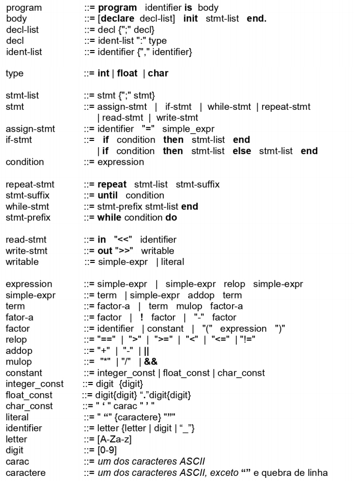

# Compilador
Desenvolvimento de um compilador em C++ para a gramática abaixo: 

## Analisador Léxico - Parte 1

Para o analisador Léxico, escolheu-se utilizar a modelagem por estado, na qual desenvolveu-se uma árvore de derivação que para a leitura de cada caracter, informa qual seria o próximo estado, ou se encontrou um token ou alguma espécie de erro.

Devido ao tamanho da gramático, a árvore ficou enorme, inviável de anexá-la aqui, por isso anexamos o exemplo de apenas uma parte e, caso tenham interesse, podem acessar integralmente através do [link do Drawio](https://drive.google.com/file/d/13-J8tpEmDeckLj1NGf_um_Rm7pPuR3NM/view?usp=sharing) e fazer comentários, para que o desenvolvimento seja contínuo.
