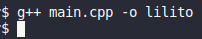
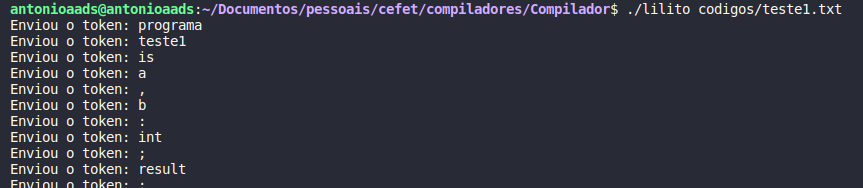
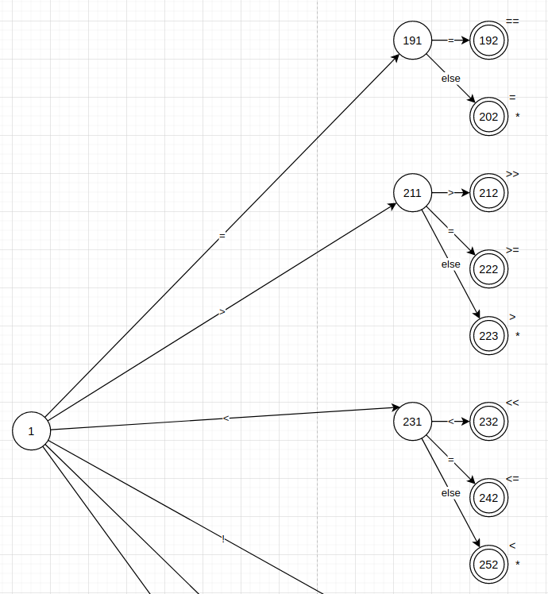
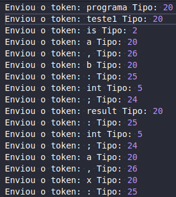
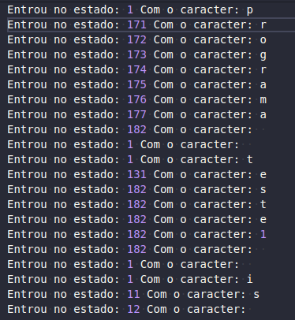

# Compilador LiliTo
Desenvolvimento de um compilador em C++ para a gramática abaixo: 

## Analisador Léxico - Parte 1

Para o analisador Léxico, escolheu-se utilizar a modelagem por estado, na qual desenvolveu-se uma árvore de derivação que para a leitura de cada caracter, informa qual seria o próximo estado, ou se encontrou um token ou alguma espécie de erro.

Devido ao tamanho da gramática, a árvore ficou enorme, inviável de anexá-la aqui, por isso anexamos o exemplo de apenas uma parte e, caso tenham interesse, podem acessar integralmente através do [link do Drawio](https://drive.google.com/file/d/13-J8tpEmDeckLj1NGf_um_Rm7pPuR3NM/view?usp=sharing) e fazer comentários, para que o desenvolvimento seja contínuo.

### Compilação

Para compilar, basta ter o g++ instalado e executar o comando g++ main.cpp -o lilito. Isso irá gerar um executável na qual poderá utilizar para executar o compilador desenvolvido.

### Execução

O compilador desenvolvido, recebe como parâmetro o caminho do arquivo que se deseja compilar. Para isso, basta executar o comando: ./lilito caminho_do_programa. No exemplo abaixo, estamos analisando o arquivo que está dentro do diretório códigos e que possui o nome teste1, que corresponde ao código fornecido no enunciado do trabalho, disponível através do [link](github/enunciado.pdf):

### Implementação

Criamos um arquivo chamado Token.cpp no qual contém a estrutura do Token (atualmente está com apenas lexema e type) e o enum de tipos de token disponíveis na gramática. A ideia de separar em uma classe específica se deu para facilitar mudanças futuras, na qual podem surgir de acordo com a necessidade das próximas etapas do projeto.

O arquivo LexicalAnalyzer.cpp, possui a implementação do analisador léxico, na qual escolheu-se a implementação utilizando switch cases com o nome dos estados que foram definidos na árvore disponível no drawio. É importante ressaltar que a numeração dos estados não é aleatória, na qual o último dígito representa em qual nível do progresso de identificação de um token ele está (ex, 1 - leu o primeiro carractere, 2 - leu o segundo, e assim por diante), e o primeiro ou os dois primeiros, representam uma lógica para identificação de um padrão, na qual cada tipo de token terá o seu próprio fluxo, logo o seu próprio id.

Na imagem abaixo por exemplo, que comtempla uma parte da árvore que foi criada, o 19 representa o fluxo das lógicas iniciadas com igual, na qual pode se derivar no estado 192, que representa o operador ==, ou pode alterar a lógica para o estado 202, que é responsável por identificar o apenas o operador =. Todos os estados intermediários estão listados no switch do analisador léxico, mas é importante ressaltar que nem todos estados finais são listados, pois em alguns casos isso não é necessário.

Para validar o devido comportamento do método getNextToken, foi feito, na main, um while que chama o método até ter o fim de arquivo. Toda operação é registrada em um arquivo de log, que tem caminho igual a: log/caminho-execucao. 

### Log

Foi feito dois tipos de log, um que registra apenas o retorno do token, e outro que registra a entrada de cada estado, o que facilita na depuração de possíveis erros no analisador. A ativação desses logs é feita na intância do analisador, LexicalAnalyzer a1(arquivo, true, false), na qual o primeiro true corresponde ao log de token, e o false ao log de estado.

### Testes
